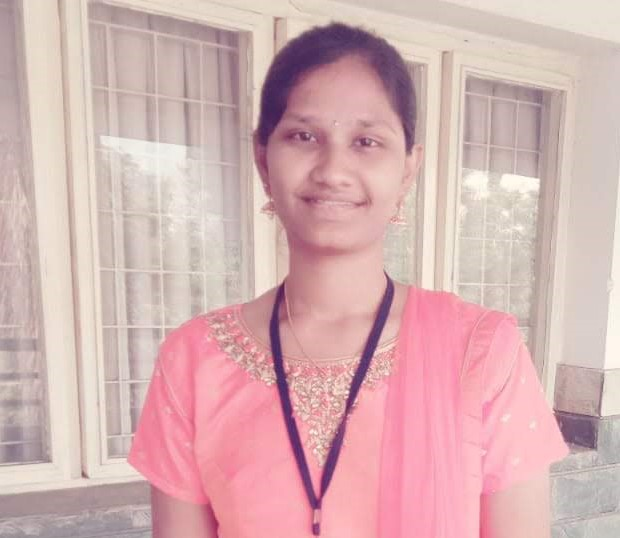

# Tejaswi Avula

This is my big-data development repository

## Current
 - Iam in the final semester of my master's degree in Applied Computer Science
 
## Background
- I am from Guntur, INDIA . 
- I have completed my undergraduate in Vignan University in the stream of Electronics and Communication Engineering 
- I have no prior experience in the software industry till I became a student at Northwest Missouri University.
 
## Plans
- I have not yet decided on any technology that I need to work on
- But I am interested in doing database work 
-  I have come to know that there are several vertical roles that we could find in the domain database like Data Scientist, Data Analyst and Database Administrator.

## Links

 [LinkedIn profile](https://www.linkedin.com/in/tejaswi-avula-40296a209/)

 [GitHub profile](https://github.com/tejaavula)

  

